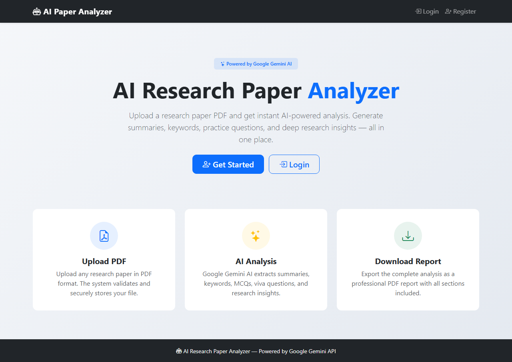
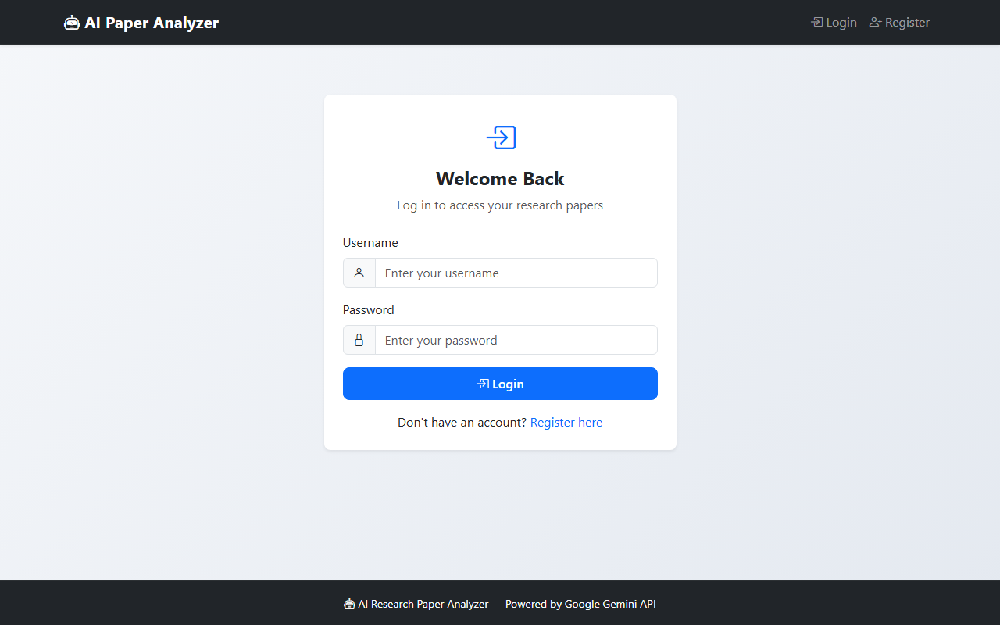
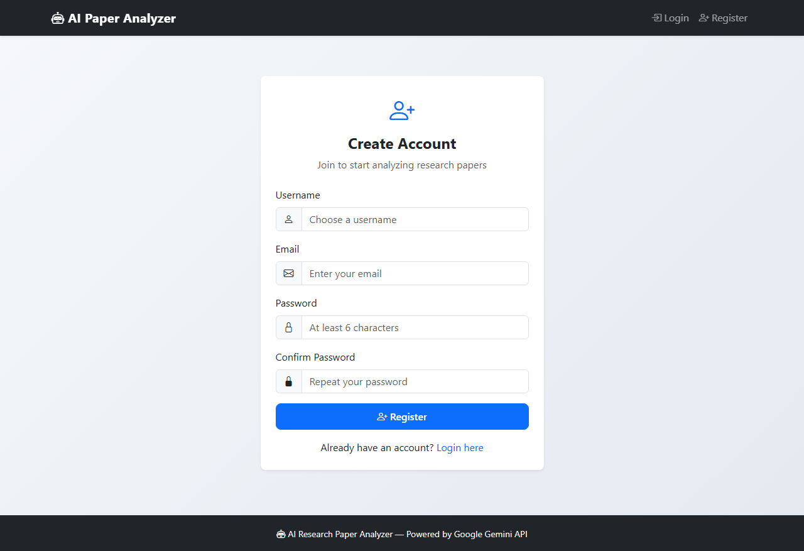
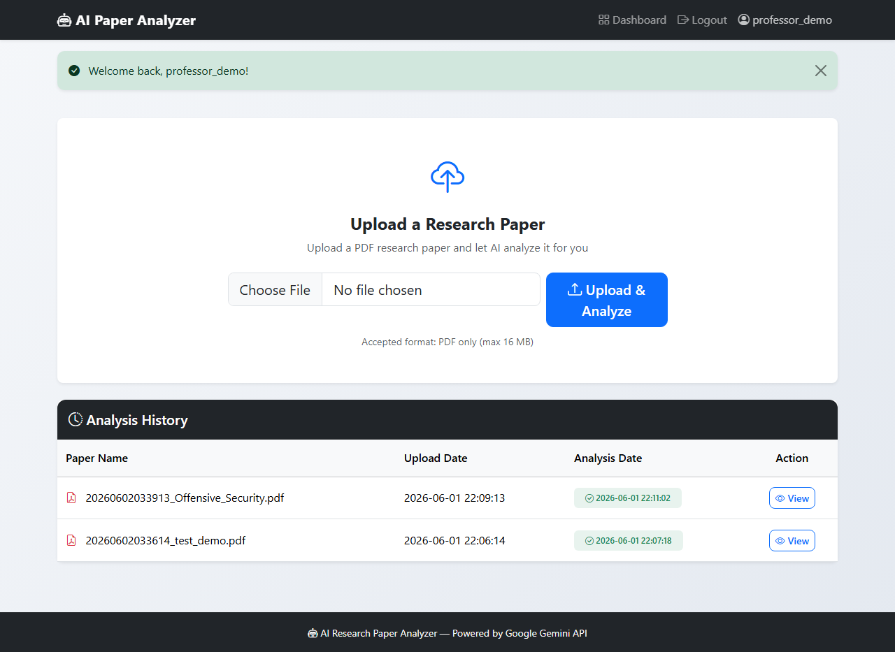
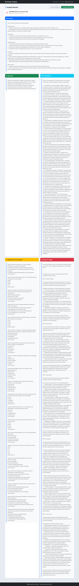

<div align="center">
  <br>
  
  
  
  
  
  <br>
  
  
  

  <br><br>

  <!-- Replace with your actual screenshot -->
  <!--  -->

  <h1>AI Research Paper Analyzer</h1>
  <p>
    <strong>A smart web application that analyzes research paper PDFs using Google's Gemini AI</strong>
  </p>
  <p>
    Upload a research paper &middot; Get instant AI analysis &middot; Download professional reports
  </p>
  <br>
</div>

---

## 📋 Table of Contents

- [Overview](#-overview)
- [Features](#-features)
- [Tech Stack](#-tech-stack)
- [Architecture](#-architecture)
- [Project Structure](#-project-structure)
- [Database Schema](#-database-schema)
- [Installation](#-installation)
- [Usage](#-usage)
- [Screenshots](#-screenshots)
- [API Reference](#-api-reference)
- [Security](#-security)
- [Future Scope](#-future-scope)
- [Contributing](#-contributing)
- [License](#-license)
- [Contact](#-contact)

---

## 📖 Overview

**AI Research Paper Analyzer** is a full-stack web application designed for students and researchers to streamline the process of understanding research papers. Simply upload a PDF, and the system leverages **Google Gemini AI** to generate:

- Structured summaries
- Keyword extraction
- Viva voce questions
- Multiple-choice questions
- Deep research insights

All results can be downloaded as a professional PDF report.

---

## ✨ Features

### 🔐 User Authentication
- Secure registration and login
- Password hashing with **bcrypt**
- Session management with **Flask-Login**

### 📄 PDF Upload & Processing
- Drag-and-drop file upload
- PDF format validation
- Secure filename sanitization
- Text extraction using **pdfplumber**

### 🤖 AI-Powered Analysis (Gemini API)

| Feature | Description |
|---------|-------------|
| **Summary** | Structured breakdown: Introduction, Objective, Methodology, Results, Conclusion |
| **Keywords** | Top 20 important terms extracted from the paper |
| **Viva Questions** | 20 oral exam-style questions testing deep understanding |
| **MCQs** | 20 multiple-choice questions with correct answers |
| **Research Insights** | Problem, Gap, Methodology, Limitations, Future Scope |

### 📊 Results Dashboard
- Clean Bootstrap 5 card layout
- Color-coded sections for easy navigation
- Responsive design for all devices

### 📑 PDF Report Generation
- Professional report layout using **ReportLab**
- One-click download
- Includes all analysis sections

### 📚 Analysis History
- Persistent storage in SQLite
- View past analyses anytime

---

## 🛠 Tech Stack

| Layer | Technology |
|-------|-----------|
| **Backend** | Python 3.8+, Flask 3.0 |
| **Frontend** | HTML5, CSS3, Bootstrap 5.3 |
| **Database** | SQLite 3 (WAL mode) |
| **AI Engine** | Google Gemini API (`gemini-pro`) |
| **PDF Parsing** | pdfplumber |
| **PDF Generation** | ReportLab |
| **Authentication** | Flask-Bcrypt, Flask-Login |
| **Security** | Werkzeug, python-dotenv |

---

## 🏗 Architecture

```
┌─────────────┐     ┌──────────────┐     ┌─────────────┐
│   Browser   │────▶│   Flask App  │────▶│   SQLite DB │
│  (Bootstrap) │     │   (Python)   │     │             │
└─────────────┘     └──────┬───────┘     └─────────────┘
                           │
                    ┌──────▼───────┐
                    │  Google Gemini│
                    │     API      │
                    └──────────────┘
```

1. User uploads a PDF through the browser
2. Flask validates and saves the file
3. **pdfplumber** extracts text from the PDF
4. Text is sent to **Google Gemini API** with specialized prompts
5. AI responses are stored in **SQLite**
6. Results are displayed in the Bootstrap dashboard
7. User can download a **PDF report** generated by ReportLab

---

## 📁 Project Structure

```
AI-RESEARCH-PAPER-ANALYZER/
│
├── app.py                      # Main Flask application entry point
├── requirements.txt            # Python dependencies
├── .env.example                # Environment variable template
├── .gitignore                  # Git ignore rules
├── LICENSE                     # MIT License
├── README.md                   # Project documentation
│
├── database/
│   ├── .gitkeep                # Ensures directory is tracked
│   └── app.db                  # SQLite database (auto-generated)
│
├── uploads/                    # Uploaded PDF files
│   └── .gitkeep
│
├── reports/                    # Generated PDF reports
│   └── .gitkeep
│
├── static/
│   └── style.css               # Custom CSS styles
│
├── templates/
│   ├── base.html               # Base template with navigation
│   ├── index.html              # Landing page
│   ├── login.html              # Login form
│   ├── register.html           # Registration form
│   ├── dashboard.html          # User dashboard with upload & history
│   ├── result.html             # Analysis results display
│   ├── 404.html                # Not found error page
│   └── 500.html                # Server error page
│
└── screenshots/                # Application screenshots
    ├── home.png
    ├── login.png
    ├── register.png
    ├── dashboard.png
    └── results.png
```

---

## 🗄 Database Schema

### `users` Table

| Column | Type | Constraints | Description |
|--------|------|-------------|-------------|
| `id` | INTEGER | PRIMARY KEY AUTOINCREMENT | Unique user ID |
| `username` | TEXT | UNIQUE NOT NULL | Login username |
| `email` | TEXT | UNIQUE NOT NULL | Email address |
| `password_hash` | TEXT | NOT NULL | bcrypt hashed password |

### `uploaded_files` Table

| Column | Type | Constraints | Description |
|--------|------|-------------|-------------|
| `id` | INTEGER | PRIMARY KEY AUTOINCREMENT | Unique file ID |
| `user_id` | INTEGER | NOT NULL, FK → users(id) ON DELETE CASCADE | Owner |
| `filename` | TEXT | NOT NULL | Stored filename |
| `upload_date` | TIMESTAMP | DEFAULT CURRENT_TIMESTAMP | Upload time |

### `analysis_results` Table

| Column | Type | Constraints | Description |
|--------|------|-------------|-------------|
| `id` | INTEGER | PRIMARY KEY AUTOINCREMENT | Unique result ID |
| `file_id` | INTEGER | NOT NULL, FK → uploaded_files(id) ON DELETE CASCADE | Source file |
| `summary` | TEXT | | AI-generated summary |
| `keywords` | TEXT | | Extracted keywords |
| `viva_questions` | TEXT | | Generated viva questions |
| `mcqs` | TEXT | | Multiple-choice questions |
| `research_insights` | TEXT | | Research analysis |
| `generated_date` | TIMESTAMP | DEFAULT CURRENT_TIMESTAMP | Analysis time |

---

## 🚀 Installation

### Prerequisites

- **Python 3.8+** — [Download Python](https://www.python.org/downloads/)
- **pip** — Python package manager (comes with Python)
- **Google Gemini API Key** — [Get one free](https://makersuite.google.com/app/apikey)

### Step 1: Clone the Repository

```bash
git clone https://github.com/aBadRoy/AI-Research-Paper-Analyzer.git
cd AI-Research-Paper-Analyzer
```

### Step 2: Create a Virtual Environment (Recommended)

```bash
# Windows
python -m venv venv
venv\Scripts\activate

# macOS / Linux
python3 -m venv venv
source venv/bin/activate
```

### Step 3: Install Dependencies

```bash
pip install --upgrade pip
pip install -r requirements.txt
```

### Step 4: Configure Environment Variables

```bash
cp .env.example .env
```

Edit `.env` and fill in your values:

```ini
GEMINI_API_KEY=your_actual_gemini_api_key_here
SECRET_KEY=your_random_secret_key_here
```

> **Tip:** Generate a secure SECRET_KEY with:
> ```bash
> python -c "import secrets; print(secrets.token_hex(32))"
> ```

### Step 5: Run the Application

```bash
python app.py
```

Open your browser and navigate to: **http://127.0.0.1:5000**

---

## 📖 Usage

### 1. Register an Account
- Navigate to `/register`
- Enter a username, email, and password (minimum 6 characters)

### 2. Log In
- Use your credentials to log in at `/login`

### 3. Upload a Research Paper
- From the dashboard, click "Choose File" and select a PDF
- Click "Upload & Analyze"
- Wait while the AI processes the paper (10–30 seconds)

### 4. View Results
- The results page displays five analysis sections in organized cards:
  - **Summary** (blue header)
  - **Keywords** (green header)
  - **Viva Questions** (info header)
  - **Multiple Choice Questions** (warning header)
  - **Research Insights** (danger header)

### 5. Download Report
- Click "Download PDF Report" to get a complete analysis document

### 6. Review History
- All past analyses are listed in the dashboard table
- Click "View" to revisit any previous result

---

## 📸 Screenshots

<!-- Capture and add screenshots to the screenshots/ folder -->

| Page | Preview |
|------|---------|
| **Homepage** |  |
| **Login** |  |
| **Register** |  |
| **Dashboard** |  |
| **Results** |  |

> **Note:** Replace the placeholder images with actual screenshots of your running application. You can use the `screenshots/` directory for this purpose.

---

## 🌐 API Reference

### Web Routes

| Route | Method | Auth | Description |
|-------|--------|------|-------------|
| `/` | GET | No | Landing page |
| `/register` | GET, POST | No | User registration |
| `/login` | GET, POST | No | User login |
| `/logout` | GET | Yes | Log out |
| `/dashboard` | GET | Yes | User dashboard |
| `/upload` | POST | Yes | Upload PDF & analyze |
| `/result/<id>` | GET | Yes | View analysis results |
| `/download_report/<id>` | GET | Yes | Download PDF report |

### Status Codes

| Code | Description |
|------|-------------|
| 200 | Success |
| 302 | Redirect (e.g., after login) |
| 404 | Page not found |
| 413 | File too large (>16 MB) |
| 500 | Internal server error |

---

## 🔒 Security

| Measure | Implementation |
|---------|---------------|
| **Password Storage** | bcrypt hashing (via Flask-Bcrypt) |
| **Session Management** | Flask-Login with secure cookies |
| **File Validation** | Extension whitelist (PDF only) |
| **File Size Limit** | 16 MB maximum upload |
| **Filename Sanitization** | Werkzeug `secure_filename` |
| **SQL Injection** | Parameterized queries (not f-strings) |
| **CSRF Protection** | Flask's built-in protection |
| **Environment Variables** | API keys never hard-coded |
| **Error Handling** | Custom error pages (404, 413, 500) |

---

## 🔮 Future Scope

- [ ] **AI Chat** — Ask questions about the uploaded paper using RAG (LangChain + FAISS)
- [ ] **Batch Upload** — Analyze multiple papers at once
- [ ] **Export Formats** — Support DOCX, TXT, JSON exports
- [ ] **Email Reports** — Send analysis reports via email
- [ ] **Dashboard Charts** — Visual analytics of paper metadata
- [ ] **Multi-language Support** — Analyze papers in various languages
- [ ] **Docker Deployment** — Containerized setup for easy hosting
- [ ] **OAuth Login** — Google/GitHub social login

---

## 🤝 Contributing

Contributions are welcome! Here's how you can help:

1. **Fork** the repository
2. **Create a feature branch**: `git checkout -b feature/amazing-feature`
3. **Commit** your changes: `git commit -m 'Add amazing feature'`
4. **Push** to the branch: `git push origin feature/amazing-feature`
5. **Open a Pull Request**

Please ensure your code follows the existing style and includes appropriate documentation.

---

## 📄 License

Distributed under the **MIT License**. See [`LICENSE`](LICENSE) for more information.

---

## 📬 Contact

**Project Maintainer** — [aBadRoy](https://github.com/aBadRoy)

Project Link: [https://github.com/aBadRoy/AI-Research-Paper-Analyzer](https://github.com/aBadRoy/AI-Research-Paper-Analyzer)

---

<div align="center">
  <br>
  <p>
    <sub>Built with ❤️ for researchers and students everywhere</sub>
  </p>
  <p>
    <a href="#">Back to Top</a>
  </p>
</div>
